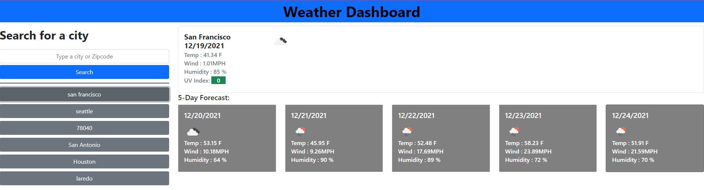

# weather-dashboard

## Purpose
A website that shows the current weather, and stores the cities search in local memeory.

## Built with 
* HTML
* CSS
* Bootstrap
* Javascript
* Jquery
* Moment Js

## Website

https://benitocr.github.io/weather-dashboard/

## Contribution
Made by Benito C.
Weather data from OpenWeather you can visit them @ https://openweathermap.org/